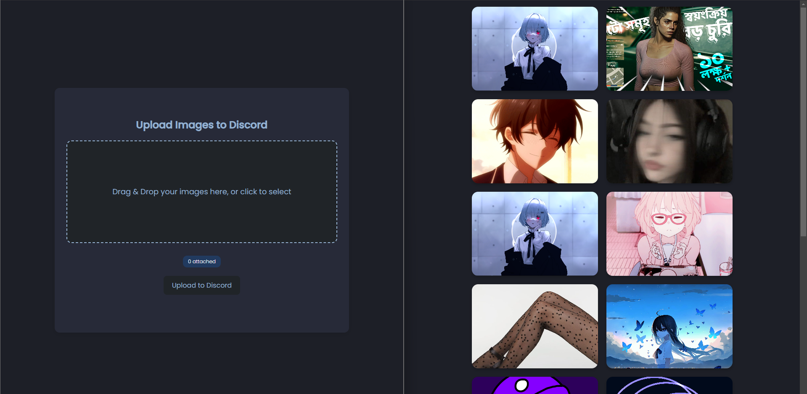

# DiscordImageBase
Realtime Image Database with Discord Bot and Node.
A web-based application for easy drag-and-drop image uploads with a live preview and seamless uploading to Discord. Designed with a focus on user experience, this app includes custom animations and smooth transitions for an engaging interface.

##### Time took: `8hrs`

---
[](demo/demo121.mp4)


## Main Features

- **Drag-and-Drop Upload**: Supports intuitive drag-and-drop functionality for fast image selection and upload.
- **Live Preview**: Displays selected images immediately, including file size and easy removal options for each image.
- **Dynamic Status Updates**: Shows real-time upload progress, including `Uploading X of Y` to keep users informed.
- **Animated Gradient Feedback**: Success or error feedback includes animated background gradients to highlight status changes.
- **File Size and Type Validation**: Automatically checks that uploaded files are images and within size limits (up to 8MB per image).
- **Smooth Transitions for Adding/Removing Images**: Animated previews smoothly transition in/out for better visual flow and clarity.
- **Upload to Discord Integration**: Directly uploads images to a specific Discord channel in real time via a Discord bot.

---

## Getting Started

### Prerequisites
- **Node.js**: Ensure you have Node.js installed for local development.
- **Discord Bot Token**: Set up a Discord bot and obtain a token to connect with the designated Discord channel.

### Installation

1. Install packages in the repository:
```bash
npm i
```
2. Run the Code
```bash
node index.js
```

